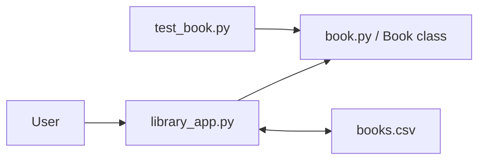

# Python Library Management System


A three-person academic Python project for managing a small library catalogue through a command-line interface.

**Portfolio case study:** https://devanshujamwal.github.io/projects/python-library-system/

## At a glance

| Area | Details |
|---|---|
| Language | Python |
| Design | Object-oriented programming |
| Persistence | CSV-style catalogue |
| Testing | Assertion-based Book-model checks |
| Collaboration | Three-person academic team |

## Architecture



## What the application does

- Load and save book records.
- View the catalogue.
- Borrow and return books.
- Find records by ISBN.
- Enable librarian-only add/remove operations.
- Run repeatable checks against the Book model.

## Portfolio refresh

The original academic source had a catalogue filename/scope problem in the save path. During the portfolio refresh I:

- traced the file/data flow;
- passed the catalogue filename explicitly;
- improved the CLI workflow;
- added a small `books.csv` sample;
- converted the Book-model checks into assertions.

## Run locally

```bash
python library_app.py
```

Run the model checks:

```bash
python test_book.py
```

## Skills demonstrated

**Python:** classes, methods, collections, file I/O, validation  
**Engineering:** debugging, variable scope, assertions, data flow  
**Teamwork:** shared codebase and clear ownership boundaries

## Documentation

- [Application architecture](./docs/architecture.md)
- [Testing notes](./docs/testing.md)

## What is verified

The current model checks cover construction, borrowing, returning, setters, title matching, availability, and genre handling. The repository does not claim complete automated coverage of every CLI path.

## What I learned

The project reinforced encapsulation, file persistence, variable scope, repeatable testing, and why explicit data flow makes software easier to debug.

## Next improvements

A future version could add automated CLI tests, stronger input validation, and persistence tests using temporary files.

---
**Devanshu Jamwal** · IT Support · Systems · Networking · Cloud  
[Portfolio](https://devanshujamwal.github.io/) · [GitHub Profile](https://github.com/Devanshujamwal)
