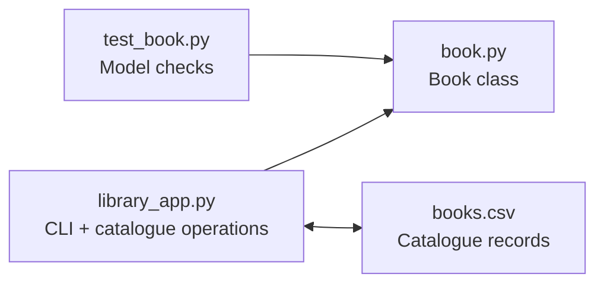

# Python Library Management System

A command-line Python application for managing a small library catalogue using object-oriented programming.

> **Portfolio case study:** https://devanshujamwal.github.io/Devanshujamwal/projects/python-library-system/

## Overview

This project was developed as a **three-person academic team project**. The repository uses a `Book` class for library records and a command-line application for catalogue operations.

The project has been refreshed for portfolio presentation while keeping the original repository history available in Git. The refresh improves the README, fixes the catalogue file-scope issue in the original application, adds a working menu flow, and turns the supplied Book checks into repeatable assertions.

## Objective

Apply object-oriented programming to library records and build a small application that can:

- load book records from a CSV-style catalogue;
- display the catalogue;
- borrow and return books;
- search records by ISBN;
- enable librarian-only add/remove operations;
- save updated catalogue data back to disk.

## Architecture



## Technologies

- Python
- Object-Oriented Programming
- File I/O
- Input validation
- Debugging
- Testing / assertions
- Git and GitHub

## Project structure

| File | Purpose |
|---|---|
| `book.py` | Encapsulates ISBN, title, author, genre, and availability in the `Book` class |
| `library_app.py` | Loads/saves the catalogue and provides the command-line workflow |
| `test_book.py` | Repeatable checks for the Book model |
| `books.csv` | Small sample catalogue for local testing |
| `OOP project.pdf` | Original academic project material |

## Run the project

Requires Python 3.10+.

```bash
python library_app.py
```

When prompted for the catalogue, press **Enter** to use the included `books.csv`.

### Main menu

- `1` — View catalogue
- `2` — Borrow a book
- `3` — Return a book
- `2130` — Enable librarian mode
- `4` — Add a book (librarian mode)
- `5` — Remove a book (librarian mode)
- `0` — Save and exit

> The librarian code is part of an academic CLI exercise. It is **not** intended as a real authentication mechanism.

## Run the model checks

```bash
python test_book.py
```

Expected result:

```text
All Book model checks passed.
```

## Implementation notes

### Book model
`book.py` stores book data behind getters/setters and exposes `borrow_it()` and `return_it()` for availability changes.

### Catalogue operations
`library_app.py` is responsible for loading records, finding ISBNs, listing books, borrowing/returning, librarian operations, and persistence.

### Portfolio refresh
The original source assigned the selected catalogue filename to a local `FILE` variable inside `load_books()`, while `save_books()` referenced `FILE` outside that scope. The refreshed version passes the catalogue filename explicitly, which gives loading and saving a consistent source of truth.

## Troubleshooting approach

For application issues, the useful sequence is:

1. Reproduce the problem with a known catalogue.
2. Trace input and data flow between the CLI and `Book` objects.
3. Check variable scope and file paths.
4. Make the smallest correction.
5. Run the repeatable model checks.
6. Exercise the affected CLI path again.

## What I learned

The project reinforced class design, encapsulation, file handling, input validation, and debugging in a shared codebase. It also showed why repeatable tests and clear ownership boundaries help teams integrate code more reliably.

## Portfolio

See the recruiter-facing case study and my other infrastructure projects:

**https://devanshujamwal.github.io/Devanshujamwal/**

---
**Devanshu Jamwal** · IT Support · Systems · Networking · Cloud
